# Diabetes Risk Prediction — Machine Learning I Group Project


Binary classification of diabetes risk from health and lifestyle indicators, using the
[CDC Diabetes Health Indicators](https://archive.ics.uci.edu/dataset/891/cdc+diabetes+health+indicators)
dataset (253,680 respondents, 21 features, ~14 % positive class).

Because a missed diagnosis (false negative) is clinically worse than a false alarm, the project
optimises **recall on the diabetic class** while keeping overall accuracy around 70 %. Four model
families are compared, each with its own hyper-parameter search and decision-threshold tuning,
and explained with SHAP.

## Authorship and contributions

Group project — Hanyang University, Machine Learning I.
Authors: Silvia Andreeva, Arthur Belloc, Artemis Maigne, Josep Monotoro.

* **My part (Josep):** data post-processing (train/test split) and the neural network (MLP) section.
* Logistic Regression, Random Forest and Gradient Boosting were developed by my teammates. The scripts for
  those sections in this repository were **reconstructed from the code shown in the appendix of the project
  report** and adapted from Google Colab to a local, reproducible pipeline, so they may differ in
  details from the original notebooks.

## Table of contents

[Results](#results-test-set-20--stratified-hold-out-50736-patients) ·
[Figures](#figures) ·
[Repository structure](#repository-structure) ·
[Getting started](#getting-started-windows--vs-code) ·
[Methodology](#methodology-in-short) ·
[Notes and limitations](#notes-and-limitations) ·
[Reproducibility](#reproducibility) ·
[Troubleshooting](#troubleshooting-windows) ·
[Dataset](#dataset) ·
[License](#license)

## Results (test set, 20 % stratified hold-out, 50,736 patients)

| Model               | Accuracy | Precision | Recall | F1     | ROC-AUC |
|---------------------|---------:|----------:|-------:|-------:|--------:|
| Logistic Regression | 0.7036   | 0.2948    | 0.8099 | 0.4322 | 0.8197  |
| Random Forest       | 0.71     | 0.30      | 0.80   | 0.44   | 0.822   |
| **Gradient Boosting** (LightGBM, binary objective) | 0.71 | 0.30 | **0.81** | 0.44 | **0.8279** |
| MLP v2              | 0.7985   | 0.3693    | 0.6305 | 0.4658 | 0.8261  |

> The table shows the values reported in the project report (run on Google Colab). Re-running locally
> reproduces Logistic Regression, Random Forest and Gradient Boosting (binary) to the last digit; the MLP
> differs slightly (see [Reproducibility](#reproducibility)).

* All models reach a very similar ROC-AUC (~0.82–0.83): the information in the features, rather
  than model complexity, seems to be the limiting factor.
* **Best model:** LightGBM with the standard binary objective (highest recall and AUC without
  sacrificing accuracy).
* **SHAP, every model:** the top-5 risk factors are `GenHlth`, `BMI`, `Age`, `HighBP` and `HighChol`.

<p align="center">
  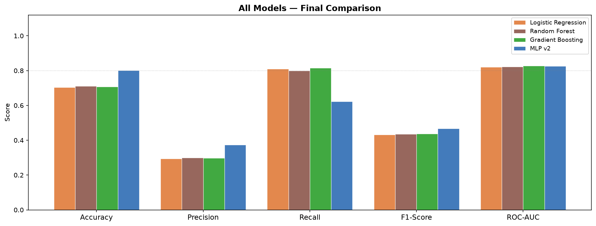
</p>

<p align="center">
  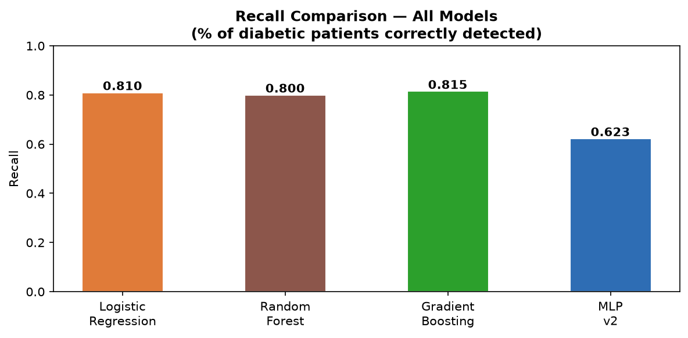
</p>

## Figures

All figures are generated by the pipeline into `figures/` (the ones committed here come from a local run).

### Data

<p align="center">
  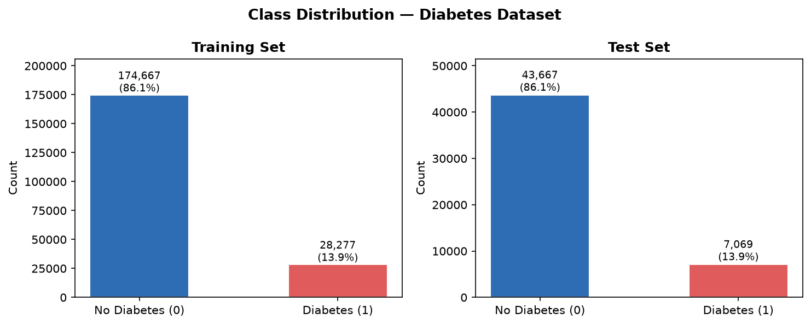
</p>

### Confusion matrices of the final models

<p align="center">
  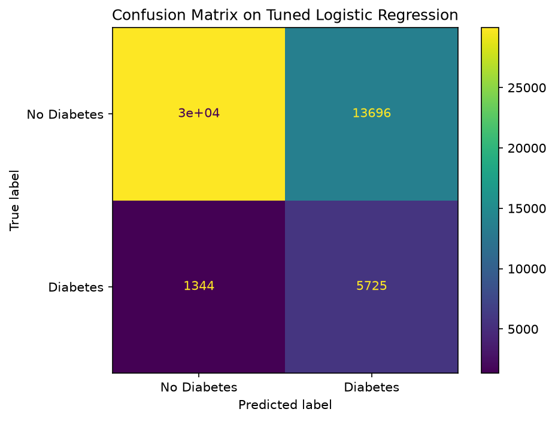
  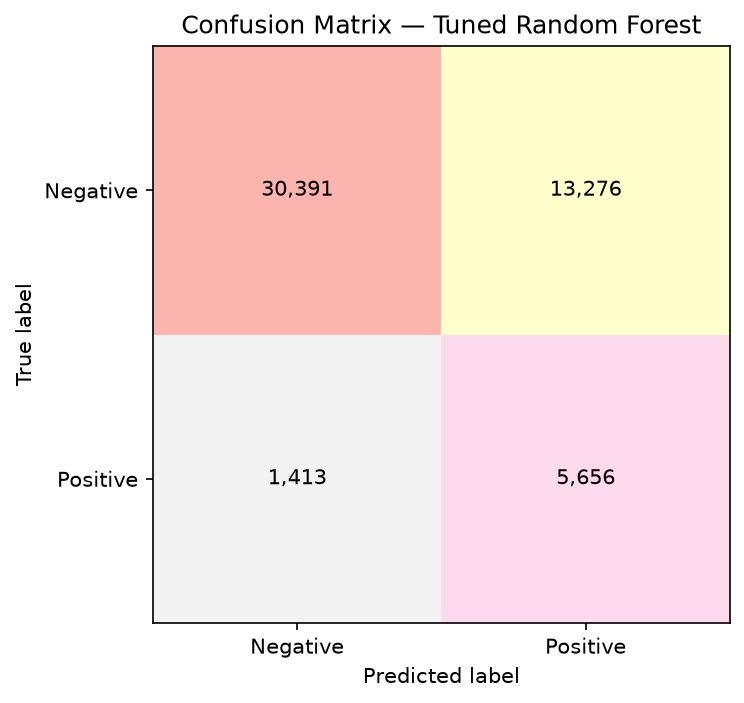
</p>
<p align="center">
  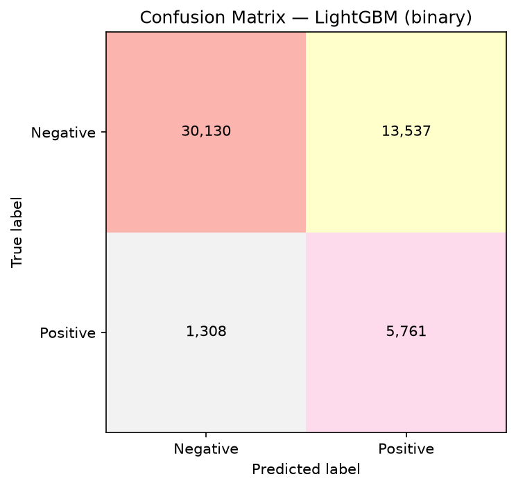
</p>
<p align="center">
  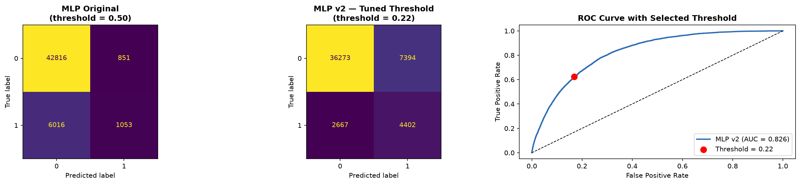
</p>

### Neural network (MLP) development

<p align="center">
  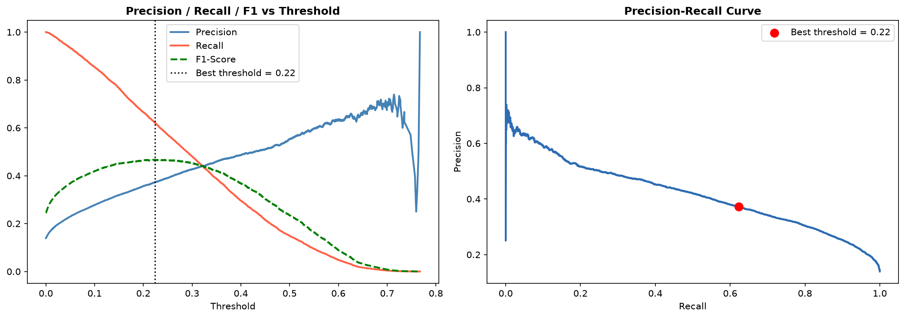
</p>
<p align="center">
  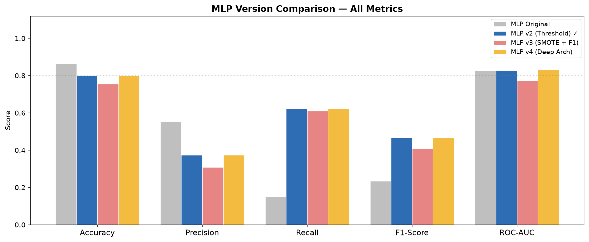
</p>

### Explainability (SHAP)

<p align="center">
  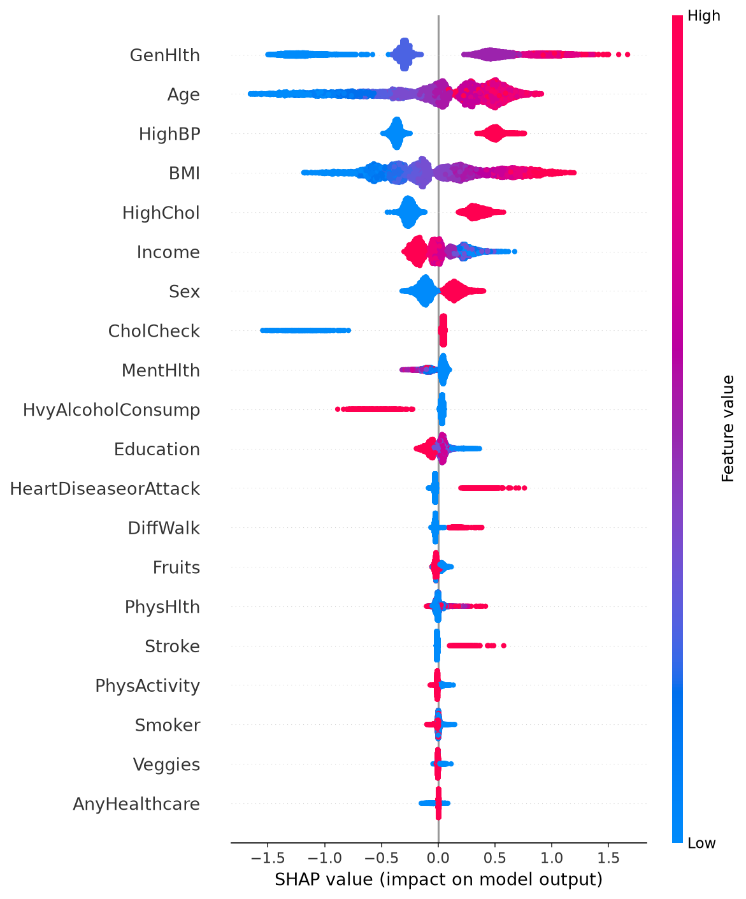
  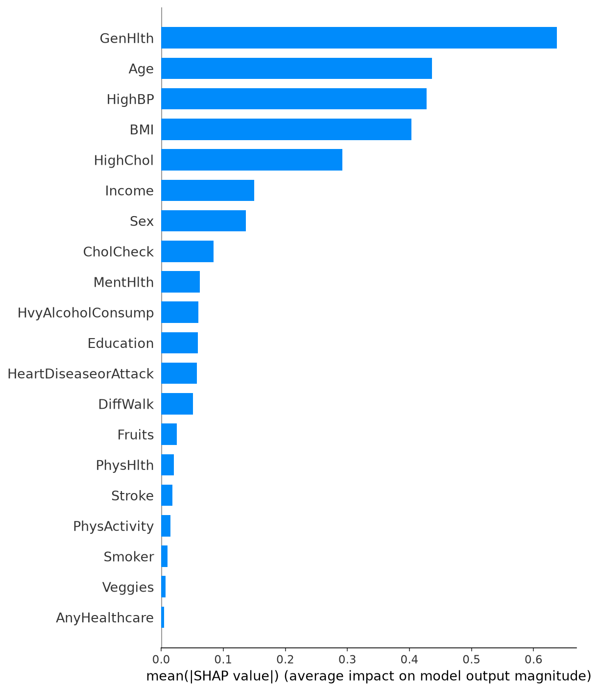
</p>
<p align="center">
  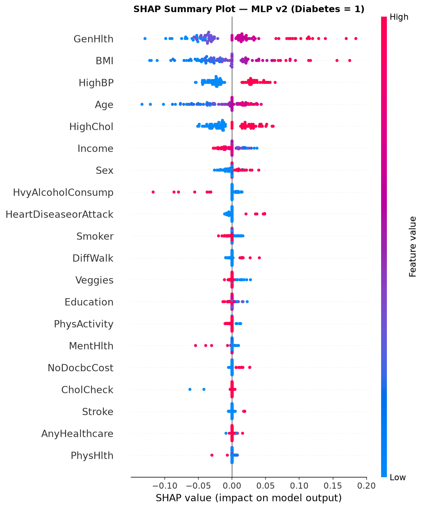
  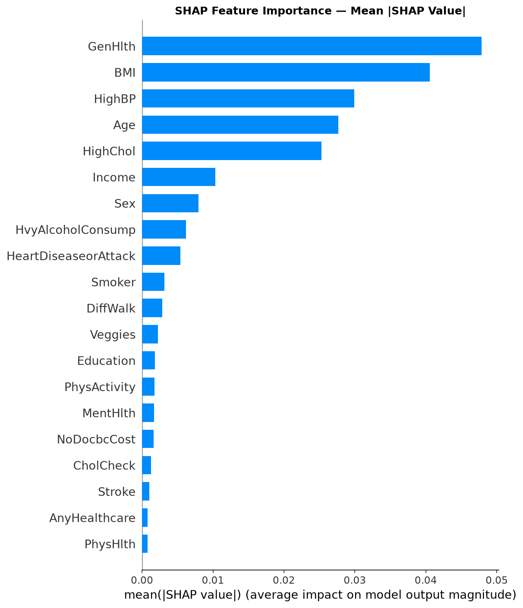
</p>

## Repository structure

```
.
├── src/
│   ├── common.py                    # paths, data loading/split, metrics, and SHAP helpers
│   ├── 01_data_preparation.py       # data checks, stratified split (Excel or UCI download)
│   ├── 02_logistic_regression.py    # normal / balanced / tuned LR + SHAP
│   ├── 03_random_forest.py          # RF, RandomizedSearchCV, threshold tuning
│   ├── 04_gradient_boosting.py      # LightGBM: custom loss / binary / balanced + SHAP
│   ├── 05_mlp_neural_network.py     # MLP original / v2 / v3 / v4 + SHAP
│   └── 06_cross_model_comparison.py # Table + charts comparing all models
├── diabetes_train_test_split.xlsx   # post-processed data (sheets "train" and "test")
├── run_all.ps1                      # full pipeline on Windows (creates .venv, installs deps)
├── run_all.sh                       # same for WSL / Linux / macOS
├── requirements.txt
├── LICENSE
├── .vscode/                         # interpreter + debug configs for VS Code
├── data/                            # created at runtime: CSV cache of the Excel (git-ignored)
├── figures/                         # generated: confusion matrices, SHAP plots, ...
├── results/                         # generated: metrics (JSON/CSV) per model
└── docs/                            # final report and .pptx presentation
```

## Getting started (Windows + VS Code)

Requirements: Python 3.10+ and Git.

### Quick start

In **PowerShell**:

```powershell
git clone https://github.com/josepjp31/Diabetes-Risk-Prediction.git
cd Diabetes-Risk-Prediction

Set-ExecutionPolicy -Scope Process Bypass   # allow scripts in this PowerShell session only
.\run_all.ps1 -Fast                         # creates .venv, installs requirements and runs every step
```

On WSL / Linux / macOS use `bash run_all.sh --fast` instead (`.ps1` files are PowerShell-only).

### Manual setup (VS Code)

```powershell
Set-ExecutionPolicy -Scope Process Bypass   # must come BEFORE activating the environment

python -m venv .venv
.\.venv\Scripts\Activate.ps1
pip install -r requirements.txt

code .                                      # open in VS Code
```

In VS Code choose the interpreter `.venv` (`Ctrl+Shift+P` → *Python: Select Interpreter*).

### Data

The pipeline reads the post-processed split from **`diabetes_train_test_split.xlsx` in the
repository root** (sheet `train` and sheet `test`, target column `Diabetes_binary`). The first run
converts it to CSV in `data/processed/` (reading the Excel takes about a minute); later runs use the cache.

If you don't have the Excel, either:

```powershell
python src/01_data_preparation.py --export-excel   # downloads from UCI and creates the Excel
```

or just run any script: without an Excel, the dataset is downloaded from UCI and split in the same way
(stratified 80/20, `random_state=42`). The original data come from:

```python
from ucimlrepo import fetch_ucirepo
cdc_diabetes_health_indicators = fetch_ucirepo(id=891)
X = cdc_diabetes_health_indicators.data.features
y = cdc_diabetes_health_indicators.data.targets
```

### Run the pipeline

```powershell
.\run_all.ps1 -Fast      # quick: skips the hyper-parameter searches (uses the best params of the project report)
.\run_all.ps1            # full: reproduces every search (hours)
```

or step by step:

```powershell
python src/01_data_preparation.py     # loads the Excel, caches it as CSV and runs the data checks
python src/02_logistic_regression.py
python src/03_random_forest.py        # add --fast to skip the search
python src/04_gradient_boosting.py    # --model binary to train only the best variant, --fast to skip the search
python src/05_mlp_neural_network.py   # --fast to skip the grid search, --retrain to refit MLP v3/v4
python src/06_cross_model_comparison.py
```

Figures are saved to `figures/` instead of being shown in a window. To display them interactively,
set `SHOW_PLOTS=1` (PowerShell: `$env:SHOW_PLOTS = "1"`).

### Approximate cost

| Script | Full run | `--fast` |
|---|---|---|
| 02 Logistic Regression (6,006 combinations + KernelSHAP) | minutes | — |
| 03 Random Forest | tens of minutes | minutes |
| 04 LightGBM (3 variants) | hours on CPU | minutes |
| 05 MLP (120-fit grid + KernelSHAP) | tens of minutes to hours | minutes |

MLP v3 (SMOTE, ~7 h) and v4 (640-fit search, ~10 h) are **not** re-searched: their results from the
original runs are stored in the script, and `--retrain` refits them with their best parameters.

## Methodology in short

1. **Data:** no missing values; 9 % duplicated rows are kept (they are different people with
   identical answers); target is imbalanced (~6:1). Stratified 80/20 split, `random_state=42`.
2. **Logistic regression:** baseline → `class_weight="balanced"` → grid over `C`, penalty/solver,
   class weight and threshold, selecting the highest validation recall with accuracy ≥ 0.70
   (best: L2, liblinear, balanced, `C=0.001`, threshold 0.46).
3. **Random forest:** randomized search (10 combos, 3-fold CV), threshold from 5-fold out-of-fold
   predictions targeting ≥ 80 % recall (best: 400 trees, depth 10, `min_samples_leaf=10`).
4. **LightGBM:** custom asymmetric cost-sensitive loss vs. standard `binary` vs. `scale_pos_weight=6.2`;
   randomized search (15 combos, 5-fold CV on raw-score AUC) and a raw-score threshold on
   out-of-fold predictions. All three variants perform almost identically.
5. **MLP:** grid search on ROC-AUC (default threshold gives recall 0.135) → F1-optimal threshold
   0.19 (v2, recall 0.63) → SMOTE (v3, worse) → deeper search (v4, +0.004 AUC, not worth it).
6. **Explainability:** SHAP (Linear/Kernel/Tree) for LR, GB and MLP; impurity importance for RF.

## Notes and limitations

* **Single hold-out split.** Hyper-parameters and thresholds were tuned on the training set (LR:
  validation split; RF/GB: cross-validation). The MLP F1-optimal threshold was chosen on the test
  set, as in the original experiments, so its test metrics are slightly optimistic.
* The LR validation split size (20 % of the training set) is an assumption (the project report does not
  state it); re-running reproduces the reported tuned model exactly.
* LightGBM runs on CPU by default (the original runs used a GPU). Set `LGBM_DEVICE=gpu` if you have
  a GPU-enabled build.
* MLP and LR SHAP values are approximations computed with `KernelExplainer` on 100 background and
  100 test samples.
* The precision of the diabetic class is low (~0.30) by design: the thresholds trade precision for
  recall. This is a coursework project, **not** a medical device.

## Reproducibility

Local run on Windows (`run_all.ps1 -Fast`, scikit-learn 1.x, CPU):

| Model | Project report | Local run |
|---|---|---|
| Logistic Regression (tuned) | recall 0.8099, AUC 0.8197 | identical (TN 29,971 / FP 13,696 / FN 1,344 / TP 5,725) |
| Random Forest (tuned) | recall 0.80, threshold 0.4764 | identical (TN 30,391 / FP 13,276 / FN 1,413 / TP 5,656) |
| Gradient Boosting, binary | recall 0.81, AUC 0.82789 | identical (TN 30,130 / FP 13,537 / FN 1,308 / TP 5,761) |
| MLP v2 | threshold 0.19, recall 0.6305, acc 0.7985 | threshold 0.22, recall 0.6227, acc 0.8017 |

* **MLP:** neural-network training is not bit-reproducible across library versions / hardware (the report's
  runs were on Google Colab), so the learned weights, and therefore the F1-optimal threshold, differ a little.
  The conclusions do not change (ROC-AUC 0.826 in both).
* **LightGBM `--fast`:** the *custom-loss* and *balanced* variants are trained with the best parameters of the
  *binary* model instead of their own searches, so their numbers differ slightly from Models 1 and 3 of the
  report. Run `python src/04_gradient_boosting.py` without `--fast` to search each variant separately.

## Troubleshooting (Windows)

| Symptom | Cause | Fix |
|---|---|---|
| `.\\run\_all.ps1 : El término ... no se reconoce` | The command was copied from rendered Markdown with escaped characters (`\_`, `\\`) | Type or copy it from a code block: `.\run_all.ps1 -Fast` |
| `.\run_all.ps1: command not found` in WSL | `.ps1` is a PowerShell script; Linux can't run it | Use a PowerShell terminal, or `bash run_all.sh --fast` in WSL |
| `.\.venv\Scripts\Activate.ps1` not recognised | `.venv` was never created | `python -m venv .venv` (or just run `.\run_all.ps1`, which creates it) |
| Activation blocked by execution policy | PowerShell policy | `Set-ExecutionPolicy -Scope Process Bypass` |
| `ModuleNotFoundError: No module named 'pandas'` / `'shap'` / `'matplotlib'` | Dependencies are not installed in the interpreter being used (global Python, or a `pip install` that was cancelled with Ctrl+C) | Run `.\run_all.ps1` again (it installs what is missing) or `pip install -r requirements.txt` with `(.venv)` active, and let it finish |
| `.venv` created on Windows doesn't work in WSL (or vice versa) | Windows venvs use `Scripts\`, Linux venvs use `bin/` | WSL uses its own `.venv-linux` (created by `run_all.sh`) |

## Dataset

CDC Diabetes Health Indicators — UCI Machine Learning Repository (id 891), available through
[`ucimlrepo`](https://pypi.org/project/ucimlrepo/) and published by UCI under the CC BY 4.0 license
(check the dataset page for the current terms). The repository ships the already split data in
`diabetes_train_test_split.xlsx`.

## License

Code released under the [MIT License](LICENSE).
